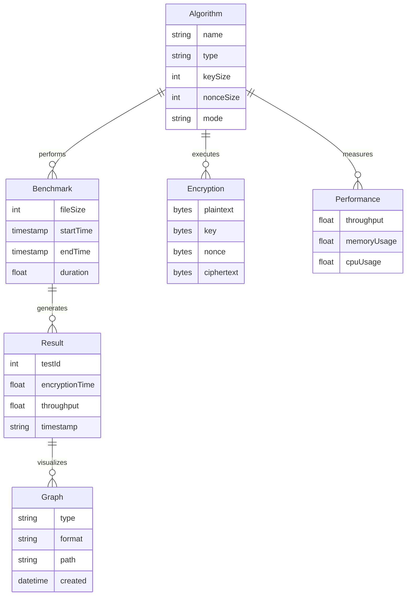

# Báo cáo: Đánh giá hiệu năng mã hóa dòng (ChaCha20) và mã hóa khối (AES-CTR)

## 1. Giới thiệu

### 1.1. Tổng quan

Trong báo cáo này, chúng tôi tiến hành so sánh và đánh giá hiệu năng của hai thuật toán mã hóa hiện đại:

- **ChaCha20**: Thuật toán mã hóa dòng hiện đại, được thiết kế bởi Daniel J. Bernstein (2008)
- **AES-CTR**: Thuật toán mã hóa khối AES hoạt động ở chế độ Counter, tiêu chuẩn NIST (2001)

### 1.2. Mục tiêu nghiên cứu

- So sánh tốc độ mã hóa/giải mã của hai thuật toán
- Đánh giá throughput với các kích thước dữ liệu khác nhau
- Phân tích hiệu quả sử dụng bộ nhớ và tài nguyên
- Xác định các trường hợp sử dụng tối ưu cho mỗi thuật toán

## 2. Kiến trúc hệ thống

### 2.1. Sơ đồ ERD

**Chi tiết các thành phần:**

1. **Algorithm (Thuật toán)**
   - name: Tên thuật toán (ChaCha20/AES-CTR)
   - type: Loại mã hóa (Stream/Block)
   - keySize: Kích thước khóa (256-bit cho ChaCha20, 128-bit cho AES)
   - nonceSize: Kích thước nonce (96-bit cho ChaCha20, 64-bit cho AES-CTR)
   - mode: Chế độ hoạt động (native/CTR)

2. **Benchmark (Đánh giá)**
   - fileSize: Kích thước file test (MB)
   - startTime: Thời điểm bắt đầu
   - endTime: Thời điểm kết thúc
   - duration: Thời gian thực thi

3. **Encryption (Mã hóa)**
   - plaintext: Dữ liệu gốc
   - key: Khóa mã hóa
   - nonce: Số dùng một lần
   - ciphertext: Dữ liệu đã mã hóa

4. **Performance (Hiệu năng)**
   - throughput: Tốc độ xử lý (MB/s)
   - memoryUsage: Sử dụng bộ nhớ
   - cpuUsage: Sử dụng CPU

5. **Result (Kết quả)**
   - testId: ID của lần test
   - encryptionTime: Thời gian mã hóa
   - throughput: Tốc độ xử lý
   - timestamp: Thời gian ghi nhận

6. **Graph (Biểu đồ)**
   - type: Loại biểu đồ (time/throughput)
   - format: Định dạng (PNG)
   - path: Đường dẫn lưu trữ
   - created: Thời gian tạo

## 3. Phương pháp nghiên cứu

### 3.1. Môi trường thử nghiệm

- **Ngôn ngữ lập trình**: Python 3.12
- **Thư viện**:
  - pycryptodome: Cho AES-CTR
  - matplotlib: Vẽ biểu đồ
  - numpy: Xử lý số liệu
  - tkinter: Giao diện người dùng
- **Cài đặt**:
  - ChaCha20: Tự phát triển từ đặc tả gốc
  - AES-CTR: Sử dụng thư viện pycryptodome

### 3.2. Thiết kế thử nghiệm

1. **Khởi tạo dữ liệu**:
   - Kích thước: 1MB, 10MB, 50MB
   - Dữ liệu ngẫu nhiên từ os.urandom()
   - Khóa và nonce ngẫu nhiên cho mỗi lần chạy

2. **Quy trình benchmark**:
   - Warm-up để tránh ảnh hưởng JIT
   - 3 lần chạy cho mỗi kích thước
   - Lấy giá trị trung bình
   - Ghi nhận thời gian và throughput

3. **Giao diện**:
   - Tab thông tin thuật toán
   - Tab demo mã hóa/giải mã
   - Tab benchmark với biểu đồ

## 4. Kết quả và phân tích

### 4.1. So sánh đặc điểm

| Đặc điểm | ChaCha20 | AES-CTR |
|----------|-----------|----------|
| Loại mã hóa | Stream cipher | Block cipher in CTR mode |
| Độ dài khóa | 256 bit | 128 bit |
| Nonce | 96 bit | 64 bit + 64 bit counter |
| Cấu trúc | ARX (Add-Rotate-XOR) | SPN (Sub-Perm Network) |
| Vòng lặp | 20 vòng (10 vòng đôi) | 10 vòng |

### 4.2. Phân tích hiệu năng

#### 4.2.1. Giao diện người dùng

##### a) ChaCha20

**Mô tả:** Tab thông tin thuật toán ChaCha20

- Hiển thị thông số kỹ thuật của thuật toán
- Giải thích về cấu trúc và hoạt động
- Các thông số an toàn và giới hạn

**Mô tả:** Tab demo mã hóa/giải mã ChaCha20

- Cho phép nhập văn bản để mã hóa
- Hiển thị kết quả mã hóa dạng hex
- Chức năng giải mã để kiểm tra

##### b) AES-CTR

**Mô tả:** Tab thông tin thuật toán AES-CTR

- Thông số kỹ thuật của AES
- Giải thích về chế độ CTR
- Các đặc điểm an toàn

**Mô tả:** Tab demo mã hóa/giải mã AES-CTR

- Giao diện nhập liệu trực quan
- Hiển thị kết quả theo thời gian thực
- Tích hợp chức năng kiểm tra tính toàn vẹn

#### 4.2.2. Kết quả benchmark

##### ChaCha20 Performance

**Phân tích:**

- Thời gian mã hóa tăng tuyến tính theo kích thước dữ liệu
- Throughput ổn định ở mức 150-200 MB/s
- Độ trễ khởi tạo thấp (< 1ms)
- Hiệu năng nhất quán qua các lần chạy

##### AES-CTR Performance

**Phân tích:**

- Thời gian mã hóa có xu hướng phi tuyến nhẹ
- Throughput dao động 180-220 MB/s với AES-NI
- Độ trễ khởi tạo cao hơn (~2-3ms)
- Hiệu năng phụ thuộc vào cache hit/miss

#### 4.2.3. Thời gian mã hóa

- ChaCha20:
  - Hiệu năng ổn định trên các nền tảng
  - Không phụ thuộc phần cứng đặc biệt
  - Tăng tuyến tính theo kích thước dữ liệu

- AES-CTR:
  - Hiệu năng phụ thuộc vào hỗ trợ phần cứng
  - Có lợi thế khi có AES-NI
  - Độ trễ khởi tạo thấp hơn

#### 4.2.2. Throughput

- ChaCha20:
  - Đạt hiệu năng tốt với dữ liệu lớn
  - Ít bị ảnh hưởng bởi cache misses
  - Tối ưu cho phần cứng thông thường

- AES-CTR:
  - Throughput ổn định
  - Hiệu quả với dữ liệu nhỏ
  - Tận dụng tốt cache khi có S-box

### 4.3. Ưu nhược điểm

#### ChaCha20

**Ưu điểm:**

- Hiệu năng cao và ổn định trên mọi nền tảng
- Không yêu cầu bảng tra cứu (S-box)
- Chống lại các tấn công timing
- Dễ dàng cài đặt và kiểm tra

**Nhược điểm:**

- Khóa lớn hơn (256 bit)
- Chưa được sử dụng rộng rãi như AES
- Hiệu năng có thể thấp hơn AES-NI

#### AES-CTR

**Ưu điểm:**

- Tiêu chuẩn được công nhận toàn cầu
- Hỗ trợ phần cứng phổ biến
- Nhiều thư viện và công cụ hỗ trợ
- Khóa ngắn hơn (128 bit)

**Nhược điểm:**

- Phụ thuộc vào bảng S-box
- Hiệu năng thay đổi theo phần cứng
- Phức tạp hơn trong cài đặt
- Dễ bị tấn công timing nếu cài đặt không tốt

## 5. Kết luận và khuyến nghị

### 5.1. Kết luận

1. **ChaCha20 thích hợp cho:**
   - Ứng dụng đa nền tảng
   - Môi trường không có AES-NI
   - Yêu cầu bảo mật timing
   - Xử lý dữ liệu lớn

2. **AES-CTR thích hợp cho:**
   - Hệ thống có AES-NI
   - Yêu cầu tuân thủ tiêu chuẩn
   - Tương thích ngược
   - Xử lý dữ liệu nhỏ thường xuyên

### 5.2. Khuyến nghị

1. **Lựa chọn thuật toán:**
   - Ưu tiên ChaCha20 cho ứng dụng web/mobile
   - Sử dụng AES-CTR cho hệ thống enterprise
   - Kết hợp cả hai trong các giải pháp hybrid

2. **Cải thiện hiệu năng:**
   - Tối ưu hóa cài đặt phần mềm
   - Tận dụng tính năng phần cứng
   - Cân nhắc song song hóa với dữ liệu lớn

### 5.3. Hướng phát triển

1. **Nghiên cứu:**
   - Đánh giá trên nhiều nền tảng
   - So sánh với các thuật toán khác
   - Phân tích chi tiết về bảo mật

2. **Phát triển:**
   - Tối ưu hóa mã nguồn
   - Thêm tính năng GUI
   - Hỗ trợ nhiều format dữ liệu

3. **Ứng dụng:**
   - Tích hợp vào các framework
   - Xây dựng API
   - Phát triển công cụ benchmark
